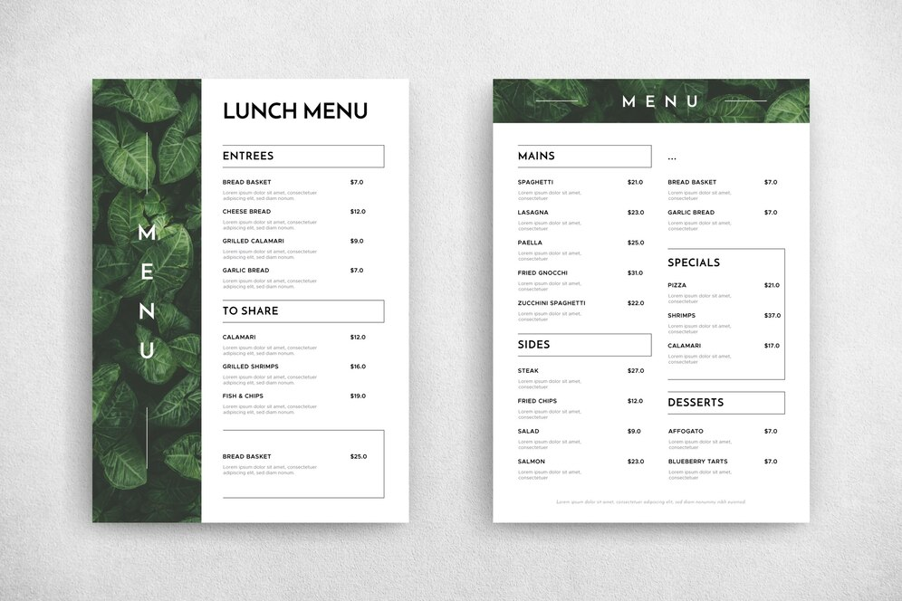
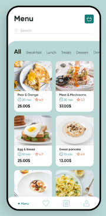

# restaurant-css-framework

1. Create a repository called **"restaurant-css-framework"**

1. Choose a **restaurant Name and a type of Food**

2. Create a **Website responsive**

1. **5 pages** 

## Pages

- **Welcome** : one Jumbotron, two panels to show news

- **Menu** : restaurant menu in the form of a grouped list with badges

- **Pictures** : Galery with 10 pictures and a pagination (3 pictures)

- **Restaurant** : About the restaurant, adress (google maps widget) and different schedules.

- **Contact** : form contact, first name, lastname, email, subject of the message, a drop list with multiple options (small groups, large groups, team buildings), send button with icon. entry with title semantically correct tag.

## My project step by step

- first step : Find a good name with a good **SEO**, choose a **country**, research in **google ads**.

#### voici les résultats :

>pour tout les résultats la concurrence est faible

| Keyword  | Volume   | Variation 3mois  |
| ------- | -------- | -------- |
| restaurant halal   | 1k-10k    | +900% |
| restaurant gastronomique  | 1k-10K|+900%|
|kebab     | 10k-100k ||
|restaurant   | 1M-10M ||

Suite à ces données, je peux interpréter que le mot **restaurant** est un des mots les plus intéressants par de la de son **volume de recherche.**
Le plus intéressant serait de lancer une campagne avec ce Keyword. Et de l'insérer dans le **nom de domaine**.

 

> d'aprés le graphique si dessus les régions Flamandes générerais plus de clics donc je pense que nous allons nous lancer sur un site en Ndls !

Pour le **domaine** je suis resté sur la combinaison de **restaurant + gastro**

----- 

## Second Step

Maintenant que nous avons le nom, le domaine et le type de nourriture concentrons nous sur la composition du site.

----
# Welcome

#### Jumbotron [Link](https://getbootstrap.com/docs/4.0/components/jumbotron/) / Réaliser un message Marketing sur la page d'atterissage.

>------
>

>  <h1 class="display-4">Ontdek Restaurant-Gastro van Vlaanderen</h1>
>  
Duik in een culinaire reis naar het hart van Vlaanderen, waar authenticiteit samensmelt met gastronomische elegantie.

>  

>  
Verken ons uitzonderlijk creatieve menu, bereid met de meest verse ingrediënten uit de regio.

>  

>    <a class="btn btn-primary btn-lg" href="#"role="button">Reserveer een Tafel</a>
>  

>

>--

---

#### Panels [Link](https://www.devwares.com/docs/contrast/javascript/components/panels/) / Réaliser un message Marketing sur la page d'atterissage.

  

    
  

  

    

      <strong>Exclusieve Culinaire Ervaring</strong>
    

    

      Restaurant Gastro biedt een unieke gastronomische ervaring in het hart van Vlaanderen. Ontdek onze verfijnde menukaart met lokale ingrediënten en laat uw zintuigen betoveren door onze creatieve gerechten.
  

-----------

  

    
  

  

    

      <strong>Restaurant-Gastro - Culinair Genieten</strong>
    

    

      Restaurant-Gastro biedt een hemelse culinaire ervaring. De smaken zijn sensationeel, de presentatie verfijnd, en de sfeer intiem. Een bestemming voor fijnproevers.
    

  

------

#### Oublie pas les Grid ou les Columns

Il faudra par la suite creer 2 colonnes avec ces deux panel.

- Voici la doc pour les **Grid** : [Link](https://getbootstrap.com/docs/5.2/layout/grid/)

- Voici la doc pour les **Gutters** à essayer : [Link](https://getbootstrap.com/docs/5.2/layout/gutters/)

-----------

# Menu

## Onze Menukaart

### Voorgerechten
- **Gerookte Zalm Carpaccio**
  - Met limoen-dille dressing en kappertjes.
  - €12,50

- **Artisjokhart Salade**
  - Met verse tomaten en balsamico glazuur.
  - €10,00

### Hoofdgerechten
- **Filet Mignon**
  - Met truffeljus en geroosterde groenten.
  - €28,00

- **Gebakken Zeebaars**
  - Op een bedje van spinazie en saffraansaus.
  - €25,50

### Desserts
- **Crème Brûlée**
  - Met vanille en gekarameliseerde suiker.
  - €9,00

- **Chocolade Lava Cake**
  - Met gesmolten chocoladevulling en vanille-ijs.
  - €10,50

----------

## Drankenkaart

### Aperitieven
- **Kir Royale**
  - Crème de cassis en champagne.
  - €9,50

- **Aperol Spritz**
  - Aperol, prosecco en bruisend water.
  - €8,00

### Witte Wijnen
- **Chardonnay Reserve**
  - Een volle, romige wijn met tonen van vanille en perzik.
  - Glas: €7,50 / Fles: €35,00

- **Sauvignon Blanc**
  - Fris en fruitig met hints van groene appel en citrus.
  - Glas: €6,50 / Fles: €30,00

### Rode Wijnen
- **Merlot**
  - Zachte wijn met aroma's van rijpe pruimen en kruiden.
  - Glas: €7,00 / Fles: €32,00

- **Cabernet Sauvignon**
  - Krachtig en robuust met tonen van zwarte bessen en eiken.
  - Glas: €8,00 / Fles: €38,00

### Speciale Dranken
- **Gin-Tonic**
  - Keuze uit verschillende premium gins en tonics.
  - €10,00

- **Whiskey Sour**
  - Bourbon, citroensap en suikersiroop.
  - €9,00

### Niet-alcoholische Dranken
- **Virgin Mojito**
  - Fris met limoen, munt en bruisend water.
  - €5,00

- **Frisdranken**
  - Coca-Cola, Sprite, Fanta, en meer.
  - €3,50

### Koffie en Thee
- **Espresso**
  - €3,00

- **Cappuccino**
  - €4,00

- **Verse Muntthee**
  - €4,50

 

> Sur la carte on a donc 2 cartes, on peut faire une image comme un livre ouvert style mockup sur **la version pc**.

 

>Sur **la version mobile** on pourrais faire un Grid avec 2 produits par colonne, et un nav pour naviguer d'une catégorie à une autre.

------

#### Les Breakpoints 

Il faudra faire attention que les 2 mise en page restent l'une en mobile et l'une en desktop et tablette.

- Voici la doc pour les **Breakpoints** : [Link](https://getbootstrap.com/docs/5.0/layout/breakpoints/)

- Voici la doc pour le **JavaScript behavior** à essayer: [Link](https://getbootstrap.com/docs/5.0/components/list-group/#javascript-behavior)

- Voici la doc pour les **Horizontal & vertical gutters**: [Link](https://getbootstrap.com/docs/5.0/layout/gutters/#horizontal--vertical-gutters)
-----------