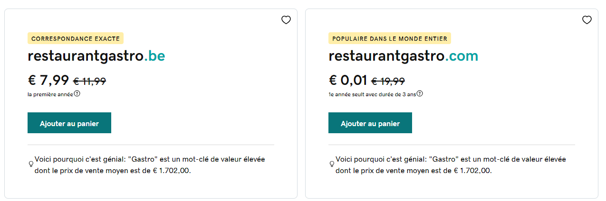
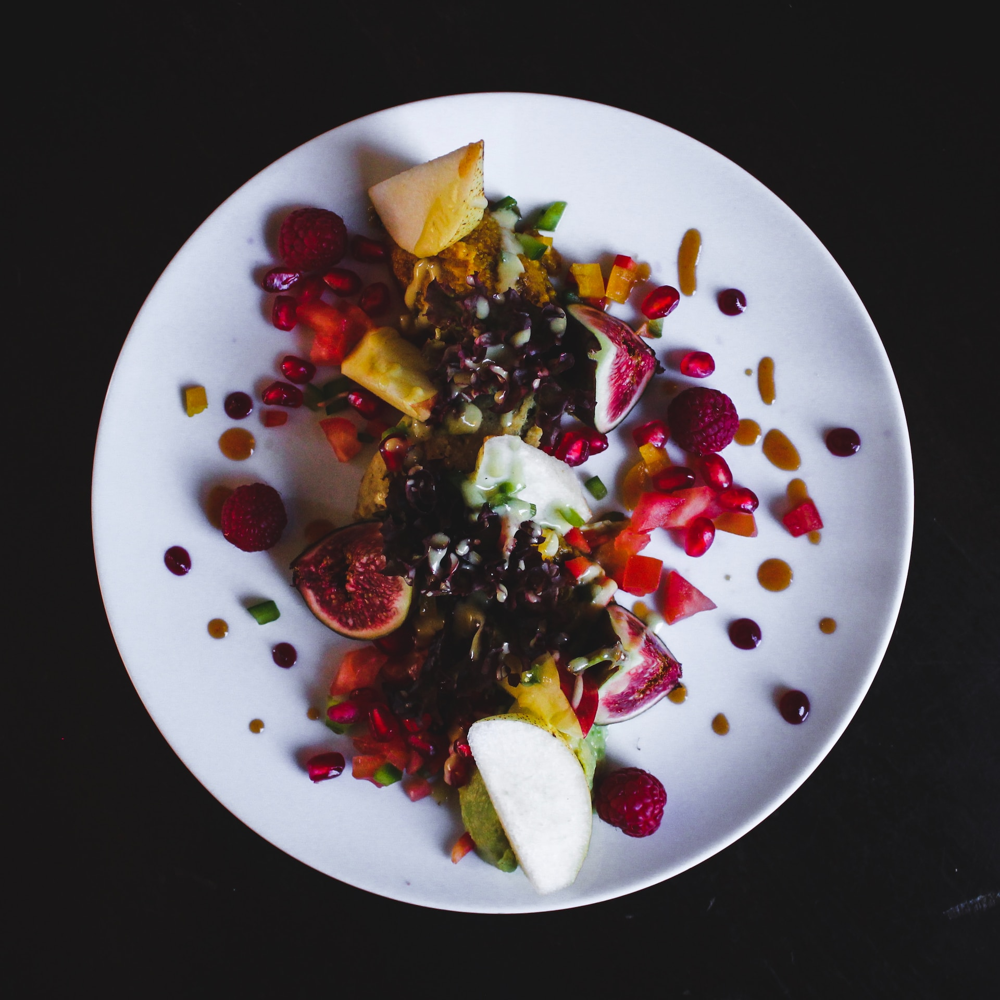

# restaurant-css-framework

1. Create a repository called **"restaurant-css-framework"**

1. Choose a **restaurant Name and a type of Food**

2. Create a **Website responsive**

1. **5 pages** 

## Pages

- **Welcome** : one Jumbotron, two panels to show news

- **Menu** : restaurant menu in the form of a grouped list with badges

- **Pictures** : Galery with 10 pictures and a pagination (3 pictures)

- **Restaurant** : About the restaurant, adress (google maps widget) and different schedules.

- **Contact** : form contact, first name, lastname, email, subject of the message, a drop list with multiple options (small groups, large groups, team buildings), send button with icon. entry with title semantically correct tag.

## My project step by step

- first step : Find a good name with a good **SEO**, choose a **country**, research in **google ads**.

#### voici les résultats :

>pour tout les résultats la concurrence est faible

| Keyword  | Volume   | Variation 3mois  |
| ------- | -------- | -------- |
| restaurant halal   | 1k-10k    | +900% |
| restaurant gastronomique  | 1k-10K|+900%|
|kebab     | 10k-100k ||
|restaurant   | 1M-10M ||

Suite à ces données, je peux interpréter que le mot **restaurant** est un des mots les plus intéressants par de la de son **volume de recherche.**
Le plus intéressant serait de lancer une campagne avec ce Keyword. Et de l'insérer dans le **nom de domaine**.

 

> d'aprés le graphique si dessus les régions Flamandes générerais plus de clics donc je pense que nous allons nous lancer sur un site en Ndls !

Pour le **domaine** je suis resté sur la combinaison de **restaurant + gastro**

----- 

## Second Step

Maintenant que nous avons le nom, le domaine et le type de nourriture concentrons nous sur la composition du site.

----
# Welcome

#### Jumbotron [Link](https://getbootstrap.com/docs/4.0/components/jumbotron/) / Réaliser un message Marketing sur la page d'atterissage.

>------
>

>  <h1 class="display-4">Ontdek Restaurant-Gastro van Vlaanderen</h1>
>  
Duik in een culinaire reis naar het hart van Vlaanderen, waar authenticiteit samensmelt met gastronomische elegantie.

>  

>  
Verken ons uitzonderlijk creatieve menu, bereid met de meest verse ingrediënten uit de regio.

>  

>    <a class="btn btn-primary btn-lg" href="#"role="button">Reserveer een Tafel</a>
>  

>

>--

---

#### Panels [Link](https://www.devwares.com/docs/contrast/javascript/components/panels/) / Réaliser un message Marketing sur la page d'atterissage.

  

    
  

  

    

      <strong>Exclusieve Culinaire Ervaring</strong>
    

    

      Restaurant Gastro biedt een unieke gastronomische ervaring in het hart van Vlaanderen. Ontdek onze verfijnde menukaart met lokale ingrediënten en laat uw zintuigen betoveren door onze creatieve gerechten.
  

-----------

  

    
  

  

    

      <strong>Restaurant-Gastro - Culinair Genieten</strong>
    

    

      Restaurant-Gastro biedt een hemelse culinaire ervaring. De smaken zijn sensationeel, de presentatie verfijnd, en de sfeer intiem. Een bestemming voor fijnproevers.
    

  

------

#### Oublie pas les Grid ou les Columns

Il faudra par la suite creer 2 colonnes avec ces deux panel.

- Voici la doc pour les **Grid** : [Link](https://getbootstrap.com/docs/5.2/layout/grid/)

- Voici la doc pour les **Gutters** à essayer : [Link](https://getbootstrap.com/docs/5.2/layout/gutters/)

-----------

